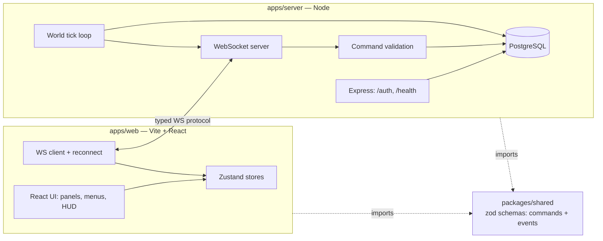

# 🌌 STARFORGE — Real-Time Multiplayer Space MMO

A persistent, grid-based outer-space empire game. Players explore a
deterministic procedural universe, found colonies, build fleets, and
compete for territory — with the server holding sole authority over
everything that matters.

This repository is built in phases (see [Roadmap](#roadmap) below). This
README reflects **Phase 1: Foundation** — the monorepo, auth, and
WebSocket scaffolding are in place; there is no map, fleets, combat, or
economy yet.

## Architecture



**Server-authoritative by design.** The client never mutates resources,
ownership, or combat outcomes directly — it sends a `Command`, the server
validates it against the current DB state, and broadcasts the resulting
`Event`(s) to affected clients. `packages/shared` holds Zod schemas for
every command and event so the wire contract can't drift between the two
sides — validated at runtime since this project uses plain JavaScript,
not TypeScript.

## Monorepo layout

```
starforge-mmo/
├── apps/
│   ├── web/            Vite + React frontend
│   └── server/          Express + ws backend, Drizzle ORM
├── packages/
│   ├── shared/           Zod command/event schemas, constants
│   └── game-engine/      deterministic seeded universe generation
├── docs/                 architecture, protocol, and schema notes
└── pnpm-workspace.yaml
```

## Development setup

Requires Node 20+ and [pnpm](https://pnpm.io) (`npm install -g pnpm`).

```bash
pnpm install
```

Copy `.env.example` to `.env` inside `apps/server/` and fill in:

- `DATABASE_URL` — a Postgres connection string. This project targets a
  free-tier cloud Postgres ([Neon](https://neon.tech) or
  [Supabase](https://supabase.com)) for development so no local Postgres
  install is required. Never commit the real value.
- `AUTH_SECRET` — any long random string for signing session tokens
  (`openssl rand -base64 48`).

Then, from the repo root:

```bash
pnpm --filter @starforge/server db:migrate   # apply schema once DATABASE_URL is set
pnpm dev:server                              # http://localhost:4000
pnpm dev:web                                 # http://localhost:5173
```

## Environment variables

See [`.env.example`](.env.example) for the full list. Nothing secret is
ever hard-coded or exposed to the browser bundle — only `VITE_*`-prefixed
values reach the client, and none of those are secrets.

## Testing

```bash
pnpm test
```

Game logic (world generation, combat, resource math, command validation)
is written to be testable independently of React and of a live database
connection, per the project's engineering goals.

## Deployment

- **Frontend**: static build (`pnpm build` in `apps/web`), deployable to
  Vercel/Netlify.
- **Backend**: targets [Railway](https://railway.app) — it keeps the
  Node process alive persistently, which a real WebSocket server
  requires (this rules out typical serverless/edge platforms). Railway
  also offers a managed Postgres add-on if you'd rather not use Neon/Supabase.
- **Database**: Postgres (Neon/Supabase for dev, Railway Postgres or
  either of those for prod).

Deployment has not yet been executed — it happens once the game has
enough functionality to be worth deploying, per the phased build plan.
Steps will be documented here when that phase runs.

## Roadmap

- [x] **Phase 1 — Foundation**: monorepo, auth scaffolding, WS protocol, design system
- [x] **Phase 2 — Universe**: deterministic generation, camera, viewport virtualization
- [ ] **Phase 3 — Player Empire**: resources, colonies, buildings, research
- [ ] **Phase 4 — Fleets**: movement, interpolation, server-authoritative commands
- [ ] **Phase 5 — Multiplayer**: live sync across multiple players, chat, reconnect
- [ ] **Phase 6 — Combat**: server-side resolution, battle logs
- [ ] **Phase 7 — Polish**: performance overlay, accessibility, sound, onboarding

## Performance considerations

The universe can contain thousands of star systems and ships. React will
not mount them directly — Phase 2 introduces canvas-based rendering with
viewport virtualization and spatial partitioning so only what's on-screen
is ever rendered, regardless of universe size.
