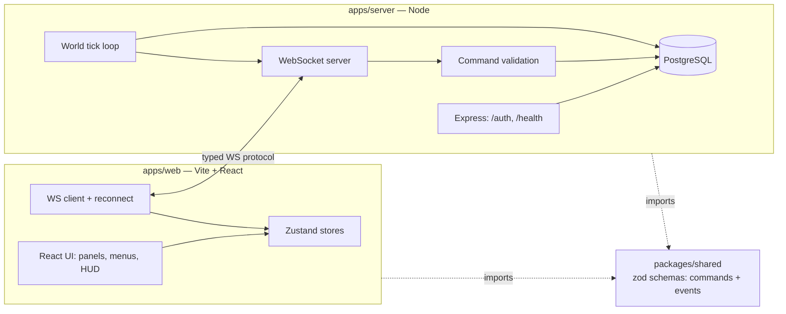

# 🌌 STARFORGE — Real-Time Multiplayer Space MMO

A persistent, grid-based outer-space empire game. Players explore a
deterministic procedural universe, found colonies, build fleets, and
compete for territory — with the server holding sole authority over
everything that matters.

This repository is built in phases (see [Roadmap](#roadmap) below).
All seven phases are complete: auth, the universe map, empire economy,
fleets, live multiplayer (shared territory, presence, chat), fleet
combat, and a polish pass (sound, accessibility, mobile layout,
extended debug overlay, onboarding, error handling).

**Live**: [starforge-mmo.vercel.app](https://starforge-mmo.vercel.app)
(frontend) talks to a persistent Node/WebSocket process on
[Railway](https://railway.app) against a real Postgres database.

## Architecture



**Server-authoritative by design.** The client never mutates resources,
ownership, or combat outcomes directly — it sends a `Command`, the server
validates it against the current DB state, and turns the result into
`Event`(s). `packages/shared` holds Zod schemas for every command and
event so the wire contract can't drift between the two sides — validated
at runtime since this project uses plain JavaScript, not TypeScript.

**Two kinds of state, two delivery rules.** Territory — colonies,
buildings, fleets, chat, presence — is public: broadcast to every
connected player, because it's what makes the universe shared. Resources
and research progress are private: sent only to the owning connection,
never to rivals. The client mirrors this split — `worldStore` holds
everyone's visible territory, `empireStore` holds only your own economy —
and the one place the routing decision is made is `commandDispatcher.js`
on the server, so no individual command handler can get it wrong.

## Monorepo layout

```
starforge-mmo/
├── apps/
│   ├── web/            Vite + React frontend
│   └── server/          Express + ws backend, Drizzle ORM
├── packages/
│   ├── shared/           Zod command/event schemas, constants
│   └── game-engine/      deterministic seeded universe generation
├── docs/                 architecture, protocol, and schema notes
└── pnpm-workspace.yaml
```

## Development setup

Requires Node 20+ and [pnpm](https://pnpm.io) (`npm install -g pnpm`).

```bash
pnpm install
```

Copy `.env.example` to `.env` inside `apps/server/` and fill in:

- `DATABASE_URL` — a Postgres connection string. This project targets a
  free-tier cloud Postgres ([Neon](https://neon.tech) or
  [Supabase](https://supabase.com)) for development so no local Postgres
  install is required. Never commit the real value.
- `AUTH_SECRET` — any long random string for signing session tokens
  (`openssl rand -base64 48`).

Then, from the repo root:

```bash
pnpm --filter @starforge/server db:migrate   # apply schema once DATABASE_URL is set
pnpm dev:server                              # http://localhost:4000
pnpm dev:web                                 # http://localhost:5173
```

### Try it out

Live at [starforge-mmo.vercel.app](https://starforge-mmo.vercel.app).
You can register your own account, or use one of two pre-seeded demo
accounts (both real accounts on the live server, useful for trying out
multiplayer solo — log in as one in a normal window and the other in
a private/incognito window):

| Username         | Password        |
| ---------------- | --------------- |
| `commander_one`  | `DemoPass123!`  |
| `commander_two`  | `DemoPass123!`  |

These are demo-only accounts with no real data behind them — expect
other people trying the demo to be poking at the same two empires.
Registering your own account works exactly the same way (any
username/password) and gets you a private empire.

Once in: select a star system on the map → found a colony → build a
shipyard → build a fleet → select the fleet → "Move fleet…" → click
the map to send it somewhere. Move a fleet to the same spot as a rival
fleet (within ~50 units) and an "Attack" button appears.

## Environment variables

See [`.env.example`](.env.example) for the full list. Nothing secret is
ever hard-coded or exposed to the browser bundle — only `VITE_*`-prefixed
values reach the client, and none of those are secrets.

## Testing

```bash
pnpm test
```

Game logic (world generation, combat, resource math, command validation)
is written to be testable independently of React and of a live database
connection, per the project's engineering goals.

## Deployment

**Live now:**

- **Frontend**: [starforge-mmo.vercel.app](https://starforge-mmo.vercel.app),
  a static build of `apps/web` on Vercel.
- **Backend**: [Railway](https://railway.app) — chosen because it keeps
  the Node process alive persistently, which a real WebSocket server
  requires (this rules out typical serverless/edge platforms).
- **Database**: the same Neon Postgres instance used in development.

**Backend — Railway:**

The service is linked to `fazal305/starforge-mmo` on `main` (`railway
service source connect`), and it builds from the repo root — not
`apps/server/` — because the server's `workspace:*` dependencies only
resolve inside the full pnpm workspace (see `railway.json` for the
build/start command). Required environment variables on the service:
`DATABASE_URL`, `AUTH_SECRET`, `NODE_ENV=production`.

**Auto-deploy-on-push isn't actually firing yet** — the repo connection
metadata is set, but no GitHub webhook exists for it (`gh api
repos/fazal305/starforge-mmo/hooks` returns empty), most likely because
the Railway GitHub App needs a one-time authorization for this repo via
the Railway dashboard (Project → Settings → Source) that isn't
completable through the CLI alone. Until that's done, redeploy manually
after pushing: `railway up --service starforge-mmo-server` from the
repo root (needs `railway login` once).

**Frontend — Vercel (continuous deploy from GitHub confirmed working):**

The Vercel project is linked at the repo root (not `apps/web`) and
connected to `main`. Unlike Railway, this auto-deploy is verified
actually firing — a deployment landed within ~2 minutes of a push,
carrying the `-git-main-` alias Vercel only assigns to git-triggered
builds. `vercel.json` at the repo root tells
Vercel how to build the monorepo: install runs at the workspace root
(where `pnpm-workspace.yaml` lives, so `workspace:*` deps resolve),
then `pnpm --filter @starforge/web build`, with `apps/web/dist` as the
output directory. `VITE_API_URL` and `VITE_WS_URL` are set as
Production environment variables on the Vercel project — Vite inlines
`import.meta.env.VITE_*` at build time, so they have to be set on
Vercel itself, not just locally.

To redeploy manually: `vercel --prod --yes` from the repo root (needs
`vercel link` once to a directory already linked to the project).

## Roadmap

- [x] **Phase 1 — Foundation**: monorepo, auth scaffolding, WS protocol, design system
- [x] **Phase 2 — Universe**: deterministic generation, camera, viewport virtualization
- [x] **Phase 3 — Player Empire**: resources, colonies, buildings, research
- [x] **Phase 4 — Fleets**: movement, interpolation, server-authoritative commands
- [x] **Phase 5 — Multiplayer**: live sync across multiple players, chat, reconnect
- [x] **Phase 6 — Combat**: server-side resolution, battle logs
- [x] **Phase 7 — Polish**: performance overlay, accessibility, sound, onboarding

## Performance considerations

The universe can contain thousands of star systems and ships. React will
not mount them directly — Phase 2 introduces canvas-based rendering with
viewport virtualization and spatial partitioning so only what's on-screen
is ever rendered, regardless of universe size.

## Polish

- **Debug overlay** (header "Debug" toggle, off by default): FPS, visible
  systems, cached sectors, total fleets in the universe, server tick,
  round-trip latency estimate, players online, your empire ID.
- **Sound**: short synthesized tones via the Web Audio API for
  selection/clicks/notifications/discovery/combat — no audio files, so
  nothing to license. Muted state persists across sessions (header toggle).
- **Accessibility**: keyboard control of the map (arrow keys pan, +/-
  zoom, Esc cancels a fleet move order), ARIA roles/labels/live regions
  on chat, connection status, and battle notifications, visible focus
  states, and durations that zero out under `prefers-reduced-motion`.
- **Mobile**: below 768px the sidebar becomes a full-screen "Panels"
  drawer instead of a fixed column, keeping the map the primary surface.
- **Errors**: a top-level error boundary shows a recovery screen instead
  of a blank crash; a dismissible onboarding hint walks new players
  through the core loop once.
